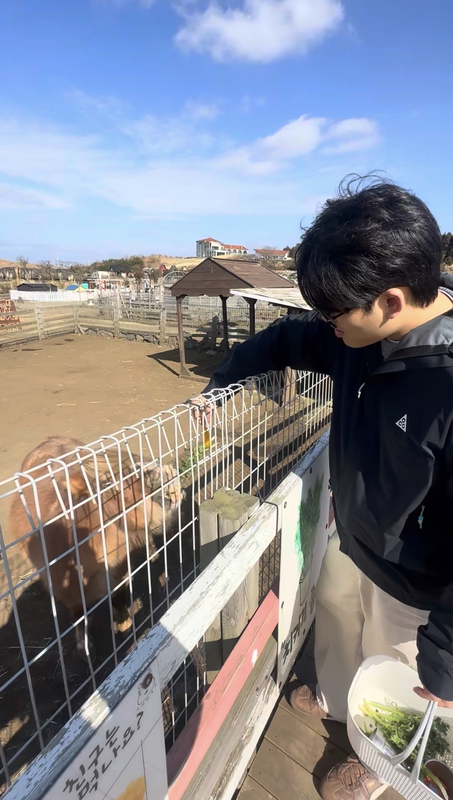

# 박창현

## 🧑‍💻 About Me

* 전공: 기계공학
* 학교: 전남대학교
* 관심 분야: 기계 설계, AI Agent
---

## 🛠 Skills

### Language

---

## 💡Interest

* Mechanical Engineering
* Manufacturing Technology
* Data Analysis
* Mechanical Component Design
* AI Agent & Automation

---

## 📫 Contact

* GitHub: [pkchanghyun-pixel](https://github.com/pkchanghyun-pixel)
* Email: [pkchanghyun@gmail.com](mailto:pkchanghyun@gmail.com)

---

